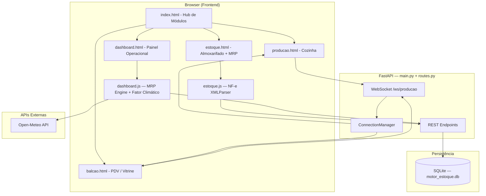

# Motor Gelato ERP

> **Sistema de gestão de estoque em 3 níveis** — Almoxarifado → Cozinha → Vitrine — com MRP inteligente, sincronização em tempo real por WebSocket e processamento client-side de NF-e.


---

## O Desafio — Cenário Real de Produção e Varejo

Operações de varejo alimentício com produção própria enfrentam um problema estrutural frequentemente ignorado por sistemas ERP genéricos: **o estoque existe em múltiplos estados físicos simultâneos**, e a comunicação entre esses estados é manual, lenta e propensa a erro.

No cenário endereçado por este projeto:

- O **Almoxarifado** recebia insumos sem rastreabilidade de validade ou custo unitário.
- A **Cozinha** transformava esses insumos em produtos acabados sem abater os ingredientes do saldo — consumo era estimado, não medido.
- A **Vitrine (PDV)** vendia produtos sem nenhuma integração com a produção — rupturas só eram descobertas quando o freezer já estava vazio.
- O **gestor** não tinha uma visão consolidada em tempo real: os dados de compra, produção e venda existiam em três planilhas diferentes, nunca sincronizadas.

O resultado: perda de insumos por validade vencida, compras reativas e caras, e ruptura frequente de produtos de maior margem.

---

## A Solução e o Impacto

O **Motor Gelato ERP** substitui esse fluxo fragmentado por um sistema de rastreabilidade completo e bidirecional, executado em rede local (LAN) sem custo de infraestrutura de nuvem.

| Problema Anterior | Solução Implementada |
|---|---|
| Estoque "caixa-preta" sem níveis | Rastreabilidade em 3 níveis com log auditável de cada movimentação |
| Compras baseadas em intuição | MRP com burn rate histórico calculado sobre inventários reais dos últimos 30 dias |
| Ruptura descoberta no PDV | WebSocket notifica a produção em < 1s quando a vitrine detecta ausência de produto |
| Entrada de NF-e manual | XML da NF-e processado no browser; apenas o payload limpo é enviado para a API |
| Sem contexto de demanda sazonal | Integração com Open-Meteo: temperatura e pluviometria ajustam as sugestões de compra |

---

## Highlights Arquiteturais

### ① Rastreabilidade de 3 Níveis com Baixa Retroativa por Ficha Técnica

O coração do sistema é o modelo de transferência auditável entre os três níveis de estoque:

```
Almoxarifado (kg/L bruto)
      │
      ▼  fator_conversao aplicado
Cozinha (unidades de trabalho)
      │
      ▼  Ficha Técnica (receita) executa a baixa proporcional
Vitrine (cubas / unidades prontas)
```

Ao registrar um lote de produção, a API percorre a **Ficha Técnica** do produto e debita automaticamente cada ingrediente da Cozinha na proporção correta. Não há lançamento manual. A rastreabilidade é completa — cada transferência é gravada com `timestamp`, `origem`, `destino`, `quantidade` e `operador`, formando um log auditável consultável pelo dashboard.

```python
# routes.py — lógica de baixa por receita na confirmação de produção
for item_receita in receita:
    cursor.execute(
        "UPDATE ingredientes SET estoque_atual = estoque_atual - ? WHERE id = ?",
        (item_receita["quantidade"] * lote_kg, item_receita["ingrediente_id"])
    )
```

---

### ② MRP com Inteligência Climática (Open-Meteo)

O módulo de **Material Requirements Planning** vai além do cálculo estático de burn rate. Para insumos marcados como `volátil`, o sistema consulta a [API Open-Meteo](https://open-meteo.com/) e aplica um **multiplicador dinâmico de demanda** sobre a sugestão de compra:

| Condição Climática | Ação | Multiplicador |
|---|---|---|
| Calor extremo (≥ 27°C, chuva < 20mm) | Aumenta pedido de reposição | `× 1.25` |
| Frio ou chuva intensa (< 21°C ou > 40mm) | Reduz pedido para proteger caixa | `× 0.80` |
| Clima neutro | Mantém base de 30 dias | `× 1.00` |

A chamada é feita com `AbortController` e timeout de 5 segundos — se a API externa falhar, o MRP carrega normalmente com multiplicador neutro. **O sistema nunca bloqueia por dependência externa.**

```javascript
// dashboard.js — multiplicador climático aplicado ao MRP
const compraAjustada = item.volatil
    ? Math.ceil(item.comprar * fatorClima)
    : item.comprar;
```

---

### ③ Real-Time Sync via WebSocket (Zero-Refresh)

A comunicação entre **Vitrine** e **Cozinha** é feita por um canal WebSocket persistente, gerenciado por um `ConnectionManager` centralizado em `ws_manager.py`. Quando o operador de PDV registra uma quebra ou ausência de produto, a informação chega à tela da cozinha **em menos de 1 segundo** — sem polling, sem refresh de página.

```python
# ws_manager.py — broadcast eficiente para todos os clientes conectados
class ConnectionManager:
    async def broadcast(self, message: str):
        for connection in self.active_connections:
            await connection.send_text(message)
```

O frontend reconecta automaticamente em caso de queda de rede (`setTimeout(conectarWebSocket, 3000)`), tornando o canal resiliente a instabilidades de Wi-Fi em ambiente de loja.

---

### ④ NF-e Processada no Client-Side (Performance Edge)

A importação de Notas Fiscais Eletrônicas utiliza uma abordagem que elimina tráfego desnecessário de arquivos binários para o servidor: **o XML é lido, sanitizado e parseado inteiramente no browser** via `FileReader` + `DOMParser` antes de qualquer chamada de rede.

```javascript
// estoque.js — parse client-side do XML de NF-e
const reader = new FileReader();
reader.onload = async function (e) {
    let text = e.target.result
        .replace(/xmlns(:\w+)?="[^"]*"/g, '')
        .replace(/<\/?(\w+:)/g, '<');

    const xmlDoc = new DOMParser().parseFromString(text, "text/xml");
    // extrai xProd, qCom, vUnCom e envia apenas o payload JSON limpo
};
```

A API recebe apenas o **payload JSON estruturado** — sem processamento de XML no backend, sem dependência de `lxml`, sem risco de upload de arquivos maliciosos.

---

### ⑤ Persistência Pragmática — SQLite sem ORM

A decisão de usar `sqlite3` puro foi deliberada e documentada:

- **Deploy zero-friction**: um único arquivo `.db` é o banco de dados completo — sem servidor, sem configuração.
- **Migrações PRAGMA**: o script `config_db.py` usa `PRAGMA table_info` para inspecionar o schema e adicionar colunas apenas quando necessário — **zero-downtime em atualizações**.
- **Rastreabilidade de queries**: SQL explícito torna cada operação auditável por qualquer desenvolvedor, independente de framework.

```python
# config_db.py — migração incremental sem ORM
colunas_existentes = [col[1] for col in cursor.execute("PRAGMA table_info(ingredientes)")]
if "estoque_almoxarifado" not in colunas_existentes:
    cursor.execute("ALTER TABLE ingredientes ADD COLUMN estoque_almoxarifado REAL DEFAULT 0")
```

---

## Diagrama de Arquitetura



---

## Tech Stack

### Backend
| Tecnologia | Uso |
|---|---|
| **Python 3.11+** | Runtime principal |
| **FastAPI** | Framework REST + documentação automática (Swagger/ReDoc) |
| **Uvicorn** | ASGI Server com suporte nativo a WebSocket |
| **SQLite 3** | Banco relacional embarcado, sem servidor |
| **python-dotenv** | Gestão de variáveis de ambiente (PINs, SMTP) |
| **smtplib + asyncio** | Envio de alertas por e-mail sem bloquear o event loop |

### Frontend
| Tecnologia | Uso |
|---|---|
| **Vanilla JS (ES2022)** | Lógica de todas as telas, sem frameworks |
| **WebSocket API** | Canal em tempo real Cozinha ↔ Vitrine |
| **DOMParser + FileReader** | Parse client-side de XML de NF-e |
| **Fetch API** | Comunicação REST com a API local |
| **CSS Custom Properties** | Design system com tema escuro/claro independente por página |
| **Syne + Inter (Google Fonts)** | Tipografia editorial |

### Infra & Tooling
| Tecnologia | Uso |
|---|---|
| **Open-Meteo** | API pública de previsão meteorológica (sem chave de API) |
| **StaticFiles (Starlette)** | Serving de CSS/JS com proteção automática contra path traversal |
| **multiprocessing.freeze_support** | Compatibilidade com empacotamento PyInstaller (Windows) |

---

## Desafios do Mundo Real e Aprendizados

**O WebSocket que caía o tempo todo.** A primeira versão do canal de comunicação entre Vitrine e Cozinha funcionava bem em testes — e quebrava consistentemente em produção. O motivo era banal: o Wi-Fi da frente de loja era instável, e qualquer queda momentânea de sinal encerrava a conexão WebSocket sem que o cliente percebesse. O resultado prático era a cozinha parando de receber alertas de ruptura silenciosamente. A solução não foi sofisticada: um `setTimeout` recursivo no cliente que tenta reconectar a cada 3 segundos quando detecta o evento `onclose`. O que aprendi foi que sistemas físicos exigem que você trate falha de rede como o estado padrão, não como exceção. Desde a implementação, não houve uma única ruptura de produto que não chegasse à cozinha.

**A matemática do CMV e o problema da baixa retroativa.** O desafio mais complexo de modelagem foi garantir que a baixa de ingredientes da Cozinha ao registrar uma produção fosse proporcional e correta. O problema não era trivial: cada produto tem uma Ficha Técnica com quantidades em unidade de receita (gramas, ml), mas o estoque da Cozinha é mantido em unidades operacionais diferentes. Além disso, um lote de produção raramente é exatamente 1 unidade — pode ser 3,5kg de um sabor. A primeira implementação debitava por unidade inteira e acumulava erro de arredondamento ao longo do dia. A versão atual aplica o `fator_conversao` por ingrediente antes do débito e usa a quantidade real do lote como multiplicador, o que faz o CMV calculado pelo sistema fechar com o inventário físico nas contagens semanais. A lição foi que modelagem de dados para operações físicas precisa refletir como o processo realmente acontece, não como é mais fácil de programar.

**Parsing de NF-e sem bibliotecas.** Quando decidi processar o XML da Nota Fiscal no browser em vez de no servidor, o maior obstáculo foi a variação de formato entre emissores. NF-es de fornecedores diferentes chegavam com namespaces XML conflitantes (`nfe:prod`, `ns2:prod`, sem prefixo) que quebravam o `DOMParser` do navegador de formas silenciosas — o parse não lançava erro, mas retornava uma árvore DOM vazia. A solução foi uma etapa de sanitização com duas regex aplicadas antes do parse: uma remove todos os atributos `xmlns` e outra normaliza os prefixos de tag. Não é elegante, mas funciona com todos os XMLs que testei. Está documentado no código com o motivo exato.

---

## Próximos Passos e Dívida Técnica

O sistema funciona em produção, mas há decisões que foram tomadas com intenção de velocidade de entrega e que precisariam ser revisadas antes de uma implantação em escala corporativa. Não são bugs — são trade-offs conscientes.

- **Testes automatizados:** Atualmente inexistentes. Os endpoints críticos (transferência entre níveis, baixa por ficha técnica, cálculo de MRP) são os candidatos óbvios para uma suíte de testes unitários e de integração com `pytest` + `httpx`. A ausência de testes é o maior risco real do projeto hoje.

- **Autenticação por PIN → JWT:** O sistema de acesso atual usa PINs comparados em memória, lidos de variáveis de ambiente. Funciona para um único ponto de operação, mas não suporta sessões simultâneas, auditoria de quem fez o quê, nem controle granular de permissões (ex: funcionário pode registrar produção mas não pode editar fichas técnicas). A migração natural seria OAuth2 com JWT via `python-jose`, que o próprio FastAPI documenta como padrão.

- **SQLite → PostgreSQL:** O SQLite resolve bem o caso de uso atual (uma loja, acesso sequencial, sem concorrência pesada). Se o sistema for implantado em uma rede de múltiplas lojas acessando o mesmo banco remotamente, o modelo de lock de arquivo do SQLite vai ser um gargalo. A migração para PostgreSQL é direta porque o código usa SQL explícito sem ORM — a maioria das queries funciona sem alteração.

- **Containerização:** Hoje o setup depende de um ambiente Python local com versão específica. Um `Dockerfile` simples para o backend + um `docker-compose.yml` que monte o volume do banco de dados eliminaria completamente os problemas de "funciona na minha máquina" e facilitaria o deploy em qualquer servidor Linux.

- **Coordenadas do Open-Meteo hardcoded:** As coordenadas geográficas usadas na consulta climática estão fixas no código (latitude/longitude de uma cidade específica). Para um sistema generalista, isso precisaria ser configurável via variável de ambiente ou painel de administração.

---

## Como Executar Localmente

**Pré-requisitos:** Python 3.11+

```bash
# 1. Clone o repositório
git clone https://github.com/saldanha55/motor-gelato.git
cd motor-gelato

# 2. Crie e ative um ambiente virtual
python -m venv venv
venv\Scripts\activate       # Windows
# source venv/bin/activate  # Linux/macOS

# 3. Instale as dependências
pip install -r requirements.txt

# 4. Configure as variáveis de ambiente (opcional)
# Crie um arquivo .env na raiz:
# PIN_GERENTE=8520
# PIN_FUNCIONARIO=0258
# EMAIL_REMETENTE=seu@email.com
# EMAIL_SENHA=sua_senha_de_app

# 5. Execute
python main.py
```

O servidor iniciará em `http://localhost:8050` e o navegador será aberto automaticamente.

| Rota | Módulo |
|---|---|
| `/` | Hub de Módulos |
| `/estoque` | Almoxarifado, MRP e NF-e |
| `/producao` | Cozinha e Produção |
| `/balcao` | PDV / Vitrine |
| `/dashboard` | Painel Operacional (acesso por PIN) |
| `/docs` | Documentação interativa da API (Swagger UI) |

---

## Estrutura do Projeto

```
motor-gelato/
├── main.py           # Ponto de entrada: FastAPI, WebSocket, rotas HTML
├── routes.py         # Todos os endpoints REST da API (~2.000 linhas)
├── config_db.py      # Schema SQLite + migrações incrementais via PRAGMA
├── models.py         # Modelos Pydantic para validação de payloads
├── ws_manager.py     # ConnectionManager para broadcast WebSocket
├── requirements.txt  
├── css/
│   └── style.css     # Design system completo (dark/light, tokens, componentes)
├── js/
│   ├── estoque.js    # NF-e parser, transferências
│   └── dashboard.js  # Painel operacional + integração climática
└── *.html            # Interfaces de cada módulo
```

---

## Licença

MIT © [saldanha55](https://github.com/saldanha55)
